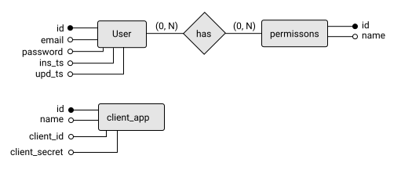

# Breve relazione
### ER Diagram

### Database structure
```
>>> show tables;
+-------------------+
| Tables_in_db_name |
+-------------------+
| oauth_apps        |
| permissions       |
| user_permissions  |
| users             |
+-------------------+

>>> describe users;
+--------+--------------+------+-----+-------------------+-----------------------------------------------+
| Field  | Type         | Null | Key | Default           | Extra                                         |
+--------+--------------+------+-----+-------------------+-----------------------------------------------+
| id     | int          | NO   | PRI | <null>            | auto_increment                                |
| email  | varchar(64)  | NO   | UNI | <null>            |                                               |
| passwd | varchar(300) | NO   |     | <null>            |                                               |
| ins_ts | timestamp    | YES  |     | CURRENT_TIMESTAMP | DEFAULT_GENERATED                             |
| upd_ts | timestamp    | YES  |     | CURRENT_TIMESTAMP | DEFAULT_GENERATED on update CURRENT_TIMESTAMP |
+--------+--------------+------+-----+-------------------+-----------------------------------------------+

>>> describe permissions;
+-------+-------------+------+-----+---------+----------------+
| Field | Type        | Null | Key | Default | Extra          |
+-------+-------------+------+-----+---------+----------------+
| id    | int         | NO   | PRI | <null>  | auto_increment |
| name  | varchar(32) | NO   | UNI | <null>  |                |
+-------+-------------+------+-----+---------+----------------+


>>> describe user_permissions;
+------------+------+------+-----+---------+----------------+
| Field      | Type | Null | Key | Default | Extra          |
+------------+------+------+-----+---------+----------------+
| id         | int  | NO   | PRI | <null>  | auto_increment |
| user       | int  | NO   | MUL | <null>  |                |
| permission | int  | NO   |     | <null>  |                |
+------------+------+------+-----+---------+----------------+


>>> describe oauth_apps;
+---------------+-------------------------------+------+-----+---------+----------------+
| Field         | Type                          | Null | Key | Default | Extra          |
+---------------+-------------------------------+------+-----+---------+----------------+
| id            | int                           | NO   | PRI | <null>  | auto_increment |
| appname       | varchar(256)                  | NO   |     | <null>  |                |
| redirect_uri  | varchar(2048)                 | NO   |     | <null>  |                |
| client_id     | varchar(256)                  | NO   |     | <null>  |                |
| client_secret | varchar(1024)                 | NO   |     | <null>  |                |
| client_type   | enum('public','confidential') | YES  |     | public  |                |
+---------------+-------------------------------+------+-----+---------+----------------+
```
### Interrogazioni realizzate per il funzionamento
Semplici operazioni di insert, update, delete.
Esempi sono presenti nel file [main.py](https://bitbucket.org/ale-cci/demo-oauth-openid/src/d2806738e39e75af747558cda42ac9ee7386aecf/backend/main.py#lines-79) [oauth\_views.py](https://bitbucket.org/ale-cci/demo-oauth-openid/src/d2806738e39e75af747558cda42ac9ee7386aecf/backend/oauth_views.py#lines-63)

### Descrizione del sito e funzionamento
Per funzionamento guarda il [README.md](./README.md)
